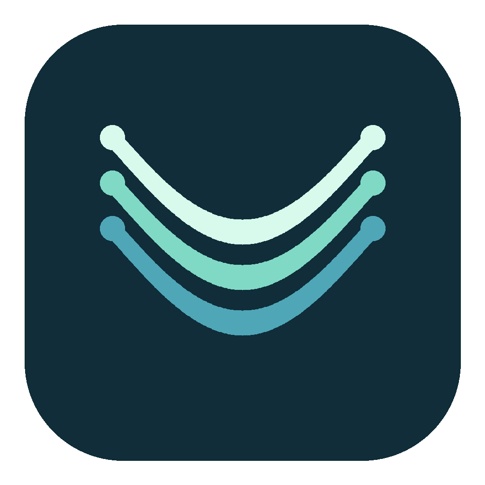

<p align="center"></p>

<h1 align="center">AirVeil</h1>
<p align="center">English · <a href="README.zh-CN.md">简体中文</a></p>
<p align="center"><strong>Look away. Blur the screen.</strong><br>A small macOS app that adds whole-screen blur when you turn your head.</p>
<p align="center">macOS 14+ · Compatible AirPods required · Public beta · Source available</p>


[Watch or download the 1080p demo](https://github.com/ZhihaoW-star/airveil/releases/download/v0.7.0-beta/airveil-demo-1080p.mp4) · [View the poster](docs/media/demo-poster.png)

*28-second illustrative animation, not a recording of the app. It shows head turns, automatic clarity, the comfort zone, reconnect attempts, and quick pause. Timing and appearance vary by device.*

AirVeil uses AirPods head motion to gently blur your Mac screen as you look away. Look back and it clears. Set a **comfort zone** so small movements do not trigger blur.

- **Your whole screen**, with blur that increases as you turn.
- **No camera**, account, subscription, analytics, or uploads in the app.
- **One-click pause**, keyboard shortcuts, and automatic reconnect attempts.
- **Normal Mac app behavior**: a Dock icon and a settings window that stays in its own space.

## Try the beta

You need **macOS 14 or later**, a Metal-capable Mac, and AirPods that provide head-motion data through Apple's Core Motion API. Pair the headphones with your Mac first. Bluetooth connection alone does not mean motion is supported.

The downloadable build is for **Apple Silicon (arm64)**. Intel support has not been device-tested; a local Intel build is experimental. Windows is not supported.

[Download the Apple Silicon beta](https://github.com/ZhihaoW-star/airveil/releases/download/v0.7.1-beta/airveil-0.7.1-beta-macos-arm64.zip), see the [release notes](https://github.com/ZhihaoW-star/airveil/releases/tag/v0.7.1-beta), or [build it yourself](#build-from-source). The beta download is locally signed, **not Developer ID signed or notarized**. macOS may block it. If you trust the source, follow [Apple's instructions for opening an app from an unidentified developer](https://support.apple.com/guide/mac-help/open-a-mac-app-from-an-unidentified-developer-mh40616/mac), or build locally. Do not disable Gatekeeper globally.

1. Open **AirVeil** and click **1. Allow screen access**. Allow it in **System Settings → Privacy & Security → Screen & System Audio Recording** (the exact name varies by macOS version). Despite that category name, AirVeil captures no audio.
2. Wear your AirPods and click **2. Connect AirPods**. Allow motion or Bluetooth access if macOS asks.
3. When screen access is ready, face the screen and click **3. Start protection**. Hold still for about 1.5 seconds. The settings window then hides by default.

Turn your head left or right to try it. If blur starts too early, move **Comfort zone** to the right. The default is ±28°, adjustable from 5° to 75°.

**Pause** clears the screen and stops screen capture. Reopen settings from the Dock or menu bar. If a setup action is still preparing access, wait for the ready message and click it again.

**Just exploring?** Drag the sample slider without granting screen access. To try your actual desktop, allow screen access and click **Try screen blur · 6 sec**. That preview ends and stops capture automatically.

## Shortcuts

Hold **Control + Option + Shift + Command**, then press:

| Key | Action |
| --- | --- |
| C | Connect AirPods |
| R | Face the screen, calibrate, and start protection |
| P | Pause / resume |
| O | Open settings |

If another app uses a shortcut, use the Dock or menu bar instead. Closing settings keeps AirVeil running; **Quit AirVeil** stops it.

## Privacy and limits

AirVeil is a visual privacy aid, **not a screen lock or a guarantee against someone reading your screen**. Lock your Mac when you leave sensitive content unattended.

- Screen images are processed **in memory on your Mac**. The app does not write screen recordings, capture audio, or upload images. Its sandbox has no network entitlement.
- Screen capture stays active while protection is running, including when the screen is clear, to reduce blur startup delay. Battery impact has not been measured.
- It detects head rotation, not your gaze or people behind you. Optional signal-strength and movement experiments are off by default and cannot reliably measure your distance from the Mac.
- When AirPods disconnect during protection, AirVeil attempts to reconnect and holds blur where the renderer remains available. A recovery panel offers **Restore screen**. It cannot guarantee protection if capture or rendering fails.
- If AirPods move to an iPhone, choose **Use iPhone** in the menu to pause. Reconnect them from macOS Bluetooth before using **Back to Mac** if needed. AirVeil cannot force Apple's automatic audio switching.
- **Pause before taking a clear screenshot or sharing your screen.** While blur is visible, a capture may include the overlay instead of the underlying app. The clear state removes that overlay from window selection.
- AirVeil excludes its own windows from screen capture to prevent feedback. Settings and recovery controls are therefore not part of the blurred image.

See [Privacy](docs/PRIVACY.md) and [Known issues](docs/KNOWN_ISSUES.md).

## Build from source

Install Apple's **Xcode Command Line Tools** (`xcode-select --install`) or Xcode. From the repository folder:

```sh
bash Source/build.sh
open dist/AirVeil.app
```

The build creates an app and an architecture-labelled ZIP in `dist/`. No package manager, account, or signing certificate is needed for a local build. The script adds a local ad-hoc signature, verifies the ZIP payload, and writes its SHA-256 checksum. It compiles for the current Mac's architecture, not a universal binary.

Run the policy, recovery, pixel-rendering, and capture-gate tests:

```sh
bash Source/Tests/run.sh
```

Tests require macOS; GPU tests need a Metal device. They do not record the desktop or need real AirPods. Passing tests does not establish real-device smoothness or battery life.

## How it works

`Core Motion → head angle → comfort zone → smoothed blur amount`

`ScreenCaptureKit → Core Image / Metal → whole-screen overlay`

The public-API renderer captures at logical display resolution, requests up to 60 fps, and keeps only the latest source image for the next render. It waits for a complete image before showing the overlay and ignores late results after Pause. There is no private compositor path in this version. Use of public APIs does not imply App Store approval.

## Help improve AirVeil

Real-world feedback is especially useful: supported AirPods models, head-turn smoothness, screenshot behavior, sleep/wake, and multiple displays. Read [Contributing](CONTRIBUTING.md) before opening an issue or submitting a change. Please remove personal screen content and device names from reports.

If AirVeil is useful to you, a star helps other people find it.

## License

**Free to use at home and at work. You may not sell AirVeil or paid versions based on it.**

The [AirVeil Free Use License 1.0](LICENSE) permits use, study, modification, and free redistribution, subject to its terms. It is a custom **source-available** license with commercial-distribution restrictions, not an OSI-approved open-source license. Do not assume eligibility for open-source benefit programs.

AirVeil is an independent project, not affiliated with Apple or OpenAI. AirPods and macOS are Apple trademarks.
