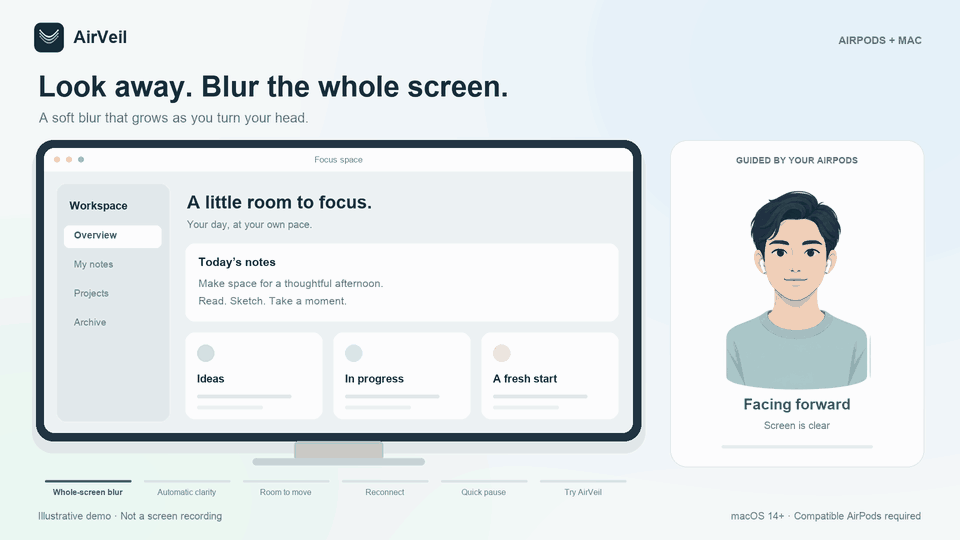

# AirVeil

[English](README.md) · 简体中文

**转头，Mac 屏幕逐渐模糊；看回来，恢复清晰。**

AirVeil 利用兼容 AirPods 的头部运动数据控制整屏模糊。不使用摄像头，不需要账号或订阅；屏幕图像在 Mac 内存中处理，不保存录屏或上传。



**这是示意动画，不是应用实录。** 实际效果与响应速度因设备而异。

## 安装前确认

- macOS 14 或更高版本，以及支持 Metal 的 Mac。
- 提供 Core Motion 头部运动数据的 AirPods。请先在 Mac 上配对并佩戴；蓝牙连接成功不代表支持头部运动数据。
- 现有下载包面向 Apple Silicon。Intel 本地构建属于实验支持，尚未经实机验证；不支持 Windows。
- 这是公开测试版，尚未在所有 AirPods、系统版本和多屏组合上验证。耗电与长时间使用体验也未完成测量。

[下载 Apple Silicon 0.7.0 测试版](https://github.com/ZhihaoW-star/airveil/releases/download/v0.7.0-beta/airveil-0.7.0-beta-macos-arm64.zip) · [发行说明](https://github.com/ZhihaoW-star/airveil/releases/tag/v0.7.0-beta)

下载包采用本地 ad-hoc 签名，**没有 Developer ID 签名或公证**。macOS 可能阻止打开。信任源码后，可参考 [Apple 的官方打开说明](https://support.apple.com/guide/mac-help/open-a-mac-app-from-an-unidentified-developer-mh40616/mac)，或自行构建。请勿全局关闭 Gatekeeper。

## 三步开始

1. 打开 AirVeil，点击 **1. Allow screen access**。在系统设置的「隐私与安全性」中允许屏幕录制权限。该权限类别可能包含音频，但 AirVeil 不采集音频。
2. 佩戴 AirPods，点击 **2. Connect AirPods**。系统询问时允许运动或蓝牙权限。
3. 等屏幕访问准备完成，面对屏幕点击 **3. Start protection**，保持稳定约 1.5 秒完成校准。设置窗口默认随后隐藏。

转头测试。如果很小的动作也触发模糊，可增大 **Comfort zone**（舒适区）。默认 ±28°，可调范围为 5°–75°。

**Pause** 会立即恢复清晰并停止屏幕采集。可从 Dock 或菜单栏重新打开设置。关闭设置窗口不会退出应用；**Quit AirVeil** 才会退出。

无需授予屏幕权限也能拖动滑块查看示例。若要预览真实桌面，请先允许屏幕访问，再点击 **Try screen blur · 6 sec**；预览结束后会自动停止采集。如果某一步正在准备权限，等就绪后再点击一次。

## 快捷键

同时按住 Control + Option + Shift + Command，再按：

| 按键 | 功能 |
| --- | --- |
| C | 连接 AirPods |
| R | 校准并开始保护 |
| P | 暂停 / 恢复 |
| O | 打开设置 |

快捷键冲突时，可用菜单栏或 Dock 操作。

## 必须知道的限制

AirVeil 是视觉辅助，**不是屏幕锁，也不能保证旁人看不到内容**。你正在看屏幕时，旁人也可能看到；离开敏感内容时请锁定 Mac。

- 它检测头部转动，不检测视线，也不检测身后的人。
- 保护运行时，即使画面清晰，屏幕采集仍保持开启，以减少模糊启动延迟。暂停后才会停止。
- AirPods 断开时会尝试重连，并在渲染仍可用时保留模糊；采集或渲染失败时无法保证保护。恢复面板的 **Restore screen** 可清屏。
- AirPods 切到 iPhone 时，选择 **Use iPhone** 暂停。回到 Mac 前可能需要在系统蓝牙菜单重新连接；应用不能强制 Apple 的音频自动切换。
- 截图或共享清晰屏幕前请先暂停，避免包含模糊覆盖层。
- 设置及恢复窗口被排除在采集中，不会作为桌面的一部分被模糊。

详见 [隐私说明（英文）](docs/PRIVACY.md) 与 [已知问题（英文）](docs/KNOWN_ISSUES.md)。

## 从源码构建

安装 Xcode Command Line Tools（`xcode-select --install`）或 Xcode，然后在仓库目录运行：

```sh
bash Source/build.sh
open dist/AirVeil.app
```

输出位于 `dist/`，包含应用、标注架构的 ZIP 和 SHA-256 校验值。构建面向当前 Mac 的架构，不是通用二进制。

**当前源码已修复预览计时器的问题**：在六秒预览中选择 Start protection 或 Blur Now 后，预览结束逻辑不应再停止新会话的屏幕采集。现有 0.7.0 下载包尚不包含这项修复。

运行自动测试：

```sh
bash Source/Tests/run.sh
```

测试需要 macOS；GPU 测试需要 Metal 设备。不采集真实桌面，也不需要真实 AirPods。测试通过不能证明所有实机的流畅度或续航表现。

## 反馈与许可

欢迎通过 [GitHub Issues](https://github.com/ZhihaoW-star/airveil/issues/new/choose) 提交兼容性与问题反馈。请说明 Mac 芯片、macOS 版本、AirPods 型号、应用版本、复现步骤和预期结果。不要附带设备序列号、蓝牙地址或私人屏幕内容。

如果它对你有帮助，欢迎 Star，方便更多人发现这个项目。

允许家庭和工作场景免费使用；不得销售 AirVeil 或基于它的付费版本。采用 [AirVeil Free Use License 1.0](LICENSE)，属于**源码可用项目，不是 OSI 批准的开源许可证**。贡献前请阅读 [贡献指南](CONTRIBUTING.md)。

AirVeil 是独立项目，与 Apple 或 OpenAI 无隶属关系。
